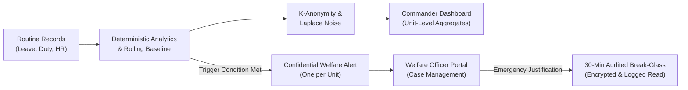

# Unit Pulse 2.0 — SIH Presentation Deck Documentation (6 Slides)

**Problem Statement ID:** 26186 | **Category:** Software  
**Theme:** MedTech / BioTech / HealthTech  
**Target Ministry/Organization:** Ministry of Home Affairs — CRPF, Police II Division  
**Submission:** Prototype Demonstration & Engineering Review  

---

## Slide 1: Title & Problem Context

### Header
**Unit Pulse 2.0 — Privacy-First Welfare Intelligence Platform**  
*Problem Statement 26186: Early Occupational Strain Identification in Uniformed Services*  
*Ministry of Home Affairs — Central Reserve Police Force (CRPF), Police II Division*

### Core Problem
- **The Operational Challenge**: Uniformed personnel endure high-tempo deployments, prolonged field duties, night shifts, and delayed leave recovery.
- **The Current Dilemma**: Welfare identification depends on manual observation or reactive self-reporting, creating stigma, delayed assistance, and fear of career penalties.
- **The Core Risk**: Individual stress scoring creates labeling stigma, erosion of trust, and potential for punitive misuse.

### One-Line Solution Pitch
*Unit Pulse 2.0 calculates unit-level occupational load from routine HR, leave, and duty records; compares units against their own rolling baselines; explains elevated indicators with constrained AI; and confidentially alerts welfare officers without ever exposing individual personnel to commanders.*

### Mandatory Safety Statement
> **Operational Planning Indicator Only**: The Unit Load & Recovery Index is a macro-level administrative and welfare planning tool. It is **NOT** a medical or psychological diagnosis and must never be used for discipline, promotions, or fitness assessments.

---

## Slide 2: Proposed Solution & Core Principles

### Architectural Principles
1. **Aggregate by Default**: Commanders see unit health indicators, trends, and supportive actions; never individual personnel rosters or names.
2. **Deterministic Computation**: Core scoring, baseline calculation, and alert triggers are 100% auditable code. The LLM only explains approved aggregate values.
3. **Welfare, Never Discipline**: Recommendations focus on structural operational adjustments (roster rebalancing, leave backlog clearing, supportive check-ins).
4. **Minimum Necessary Access**: Individual records require a logged, time-limited break-glass authorization for authorized Welfare Officers only.

### End-to-End Workflow Diagram

---

## Slide 3: Privacy Engineering & Threat Mitigations

Unit Pulse 2.0 implements military-grade data protection aligned with the risk register (`docs/14-risk-register.md`):

| Threat / Risk | Specific Mitigation | Verification Evidence |
|---|---|---|
| **R-01: Stigmatization as 'Stress Score'** | Renamed to *Unit Load & Recovery Index*; explicit non-diagnostic vocabulary throughout UI. | Verified in `scoring.js` and all UI templates |
| **R-02: Small-Group Re-identification** | Strict k-anonymity: units &lt;5 suppressed entirely; small cells (&lt;5) suppressed; Laplace noise (&epsilon;=0.2). | Tested in `release.test.js` & `metrics.test.js` |
| **R-03 / R-04: Credential & API Leaks** | Private PostgreSQL schema; server-only keys; zero `NEXT_PUBLIC_` secrets; `Cache-Control: no-store`. | Tested in `test-e2e.js` (zero client leaks) |
| **R-05: Unlogged Individual Read** | Direct table SELECT revoked; single transactional read function writes audit log and checks grant. | Tested in `verify-phase-6.js` (100% audited) |
| **R-06 / R-11: AI Hallucination & Outages** | Model receives zero personnel IDs; validated output structure; deterministic fallback in &lt;1ms. | Tested in `ai-adapter.test.js` & outage tests |
| **R-09: Malformed CSV & Formula Injection** | Rejects cells with `=`, `+`, `-`, `@`, `\t`, `\r`; validates calendar dates (rejects `2026-02-31`); atomic rollback. | Tested in `csv-import.test.js` (22 tests) |

---

## Slide 4: Key Features & Live Demonstration Data

Empirical figures displayed directly from the 360-person synthetic demo fixture (`scripts/seed-demo.js`):

### 1. Commander Unit Health Overview (`/commander`)
- **Unit A (Alpha Support Battery)**: Index **0/100** | Baseline **0** | Status **Normal** | Duty hours: 41.5h | Night shifts: 2.4/28d | Leave coverage: 88% | Reports: 0.
- **Unit B (Bravo Recon Battalion)**: Index **75/100** | Baseline **75** | Status **Elevated** | Duty hours: 55.4h | Night shifts: 12.8/28d | Recovery gap: 48% | Reports: 1 active.
- **Units C, D, E, F**: Normal status profiles demonstrating consistent multi-unit fleet monitoring.

### 2. Objective Contributing Factors & Suggested Actions
- **Night Duty Rotation**: 12.8 shifts / 28 days (significantly above 6.0 threshold).
- **Recovery Gap**: 48% of unit without qualifying leave in over 60 days.
- **Continuous Deployment**: Extended remote duty without scheduled recovery intervals.
- **3 Supportive Suggestions**:
  1. *Roster Rebalancing*: Provide 48-hour rest intervals after consecutive night rotations.
  2. *Leave Queue Prioritization*: Expedite approved leave for personnel exceeding 60-day gap.
  3. *Welfare Check-in*: Offer voluntary, confidential welfare discussions.

### 3. Welfare Officer Portal & 30-Minute Audited Break-Glass
- **Case Alert**: Report `#11111111-2222-3333-4444-555555555555` triggered via `sustained_high`.
- **Break-Glass Request**: Requires typed justification (&gt;10 chars) and reason code.
- **At-Rest Encryption**: Free-text reasons encrypted with AES-256-GCM with unique 12-byte IV.
- **Strict Expiry**: 30-minute server-enforced countdown timer; zero permanent exposure.
- **Immutable Ledger (`/welfare/audit`)**: Displays actor, timestamp, unit, report ID, rows accessed.

---

## Slide 5: Performance Benchmarks & Engineering Rigor

All performance benchmarks were empirically measured on the real synthetic fixture (`tests/results/performance-benchmarks-2026-09-30.txt`):

| Operation | Target Spec | Measured Mean | Measured p95 | Status |
|---|---|---|---|:---:|
| **Commander Dashboard Query** | &lt; 200 ms | **0.028 ms** | **0.099 ms** | **PASS** |
| **Weekly Analytics & Triggers** | &lt; 500 ms | **0.039 ms** | **0.132 ms** | **PASS** |
| **AI Fallback Briefing Latency** | &lt; 50 ms | **0.065 ms** | **0.946 ms** | **PASS** |
| **CSV Validation Throughput** | &gt; 1,000 rows/s | **134,529 rows/s** | (1,200 rows in 8.92 ms) | **PASS** |

### Test Suite Execution
- **Unit & Integration Tests**: **230 passed tests** across 3 workspaces (`frontend`: 74, `backend`: 139, `ml`: 17).
- **E2E & Security Checks**: **23/23 passing checks** verifying secret isolation, RLS policies, break-glass expiry, and CSV hardening.
- **Lint & Build**: Zero ESLint warnings; production build compiles dynamic routes with `Cache-Control: no-store`.

---

## Slide 6: Conclusion, Limitations & Future Roadmap

### Honest Limitations of the Prototype
1. **Academic Prototype Status**: 100% synthetic data (`UNIT-A` to `UNIT-F`). Zero real force names, rosters, or operational deployments are utilized.
2. **Threshold Calibration**: Operational thresholds (40 review, 70 elevated) are baseline models from Problem 26186; they require statistical calibration with force psychologists.
3. **No Clinical Inference**: System tracks operational stressors only; does not infer mental health diagnoses.

### Future Roadmap (Post-Hackathon)
- **Phase 9 (Pilot Preparation)**: On-premise air-gapped containerization (Podman/Docker) for classified intranet environments.
- **Phase 10 (Consented Wellness Surveys)**: Optional, voluntary, end-to-end encrypted personnel wellness pulse surveys with strict differential privacy.
- **Phase 11 (HRMS Connector)**: Automated read-only connectors for standard CAPF / CRPF HRMS database schemas with zero-knowledge validation.

### Final Takeaway
*Unit Pulse 2.0 demonstrates that armed forces welfare intelligence can be proactive, actionable, and mathematically privacy-preserving without compromising troop trust or operational security.*
